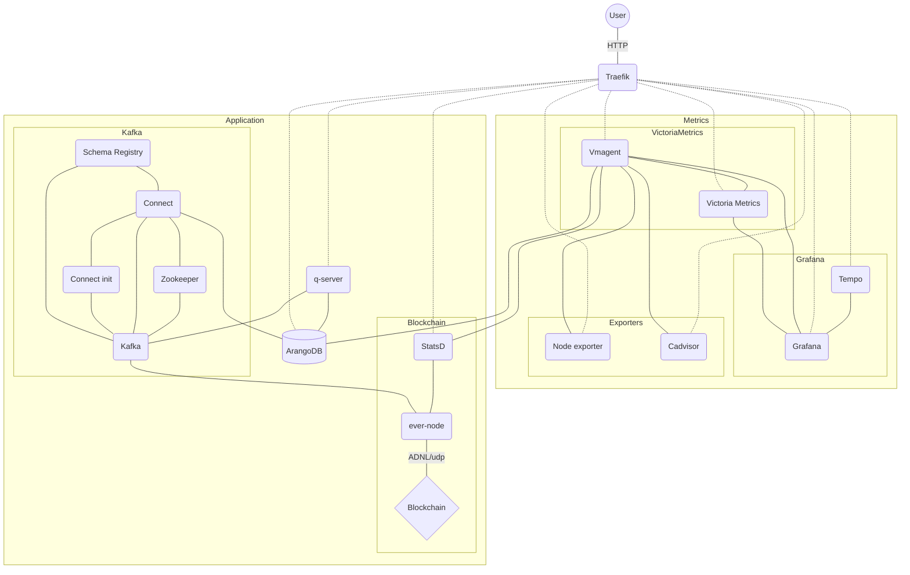
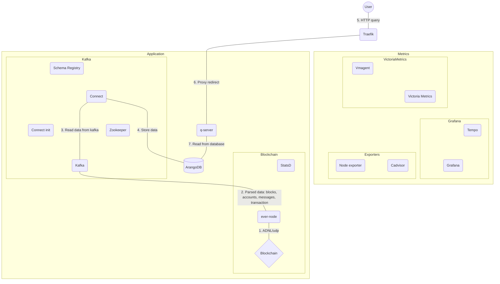

# Application server

Refactored copy of [evernode-ds](https://github.com/tonlabs/evernode-ds)

## Deploy on server

**Requirements**

* [Ansible](https://www.ansible.com)
* Server with `apt`

**Actions**

1. Place `ton-global.config.json` of network in `docker/ever-node/ton-global.config.json`.
   You can find some examples in `docker/ever-node/globals`
   ```shell
   cp -rf docker/ever-node/globals/treeton.ton-global.config.json docker/ever-node/ton-global.config.json
   ```
2. Copy `playbook/inventory.example.yaml` to `playbook/inventory.yaml` end edit
   ```shell
   cp playbook/inventory.example.yaml playbook/inventory.yaml
   ```
3. Up
   ```shell
   ansible-playbook -i playbook/inventory.yaml playbook/install.yaml
   ```

## Update on server

```shell
ansible-playbook -i playbook/inventory.yaml playbook/update.yaml
```

## Run locally and manually

**Requirements**

* [Docker](https://www.docker.com)
* [Docker Compose](https://docs.docker.com/compose)

**Actions**

1. Place `ton-global.config.json` of network in `docker/ever-node/ton-global.config.json`.
   You can find some examples in `docker/ever-node/globals`
   ```shell
   cp -rf docker/ever-node/globals/treeton.ton-global.config.json docker/ever-node/ton-global.config.json
   ```
2. Copy `.env.local` to `.env` end edit
   ```shell
   cp .env.local .env
   ```
3. Copy `.htpasswd.example` to `.htpasswd` end edit. This file protect your metrics in production.
   Default user and password is `admin:admin`
   ```shell
   cp .htpasswd.example .htpasswd
   ```
4. Create network for external HTTP and volume for ever-node
   ```shell
   docker network create traefik
   docker volume create ever-node-configs
   ```
5. Generate ever-node key
   ```shell
   docker compose --env-file .env -f keygen.yaml up
   docker compose --env-file .env -f keygen.yaml down
   ```
6. Up
   ```shell
   docker compose --env-file .env up
   ```

## Docker network scheme

* `- - -` lines - `traefik` docker network
* `—————` lines - `application` docker network



Main workflow reading data from blockchain



## Generate new `*.jar` files for Kafka Connect and ArangoDB

```shell
docker compose -f docker-compose-jars.yaml up
```

## Troubleshooting

### Detect problems on server

#### View logs

```shell
docker exec -it ever-node /bin/bash
tail -f /ever-node/logs/output.log | grep INFO
```

#### View status

```shell
watch -n 0.2 docker exec ever-node ever-node/tools/console -C /ever-node/configs/console.json -c getstats
```

### Restart docker container from local

```shell
ansible-playbook -i playbook/inventory.yaml playbook/restart-ever-node.yaml
```