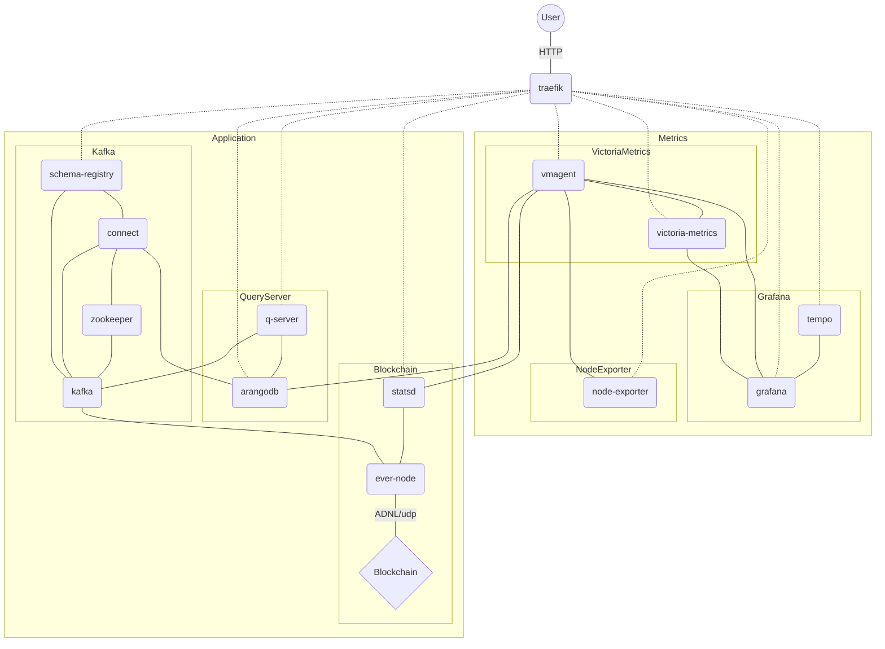
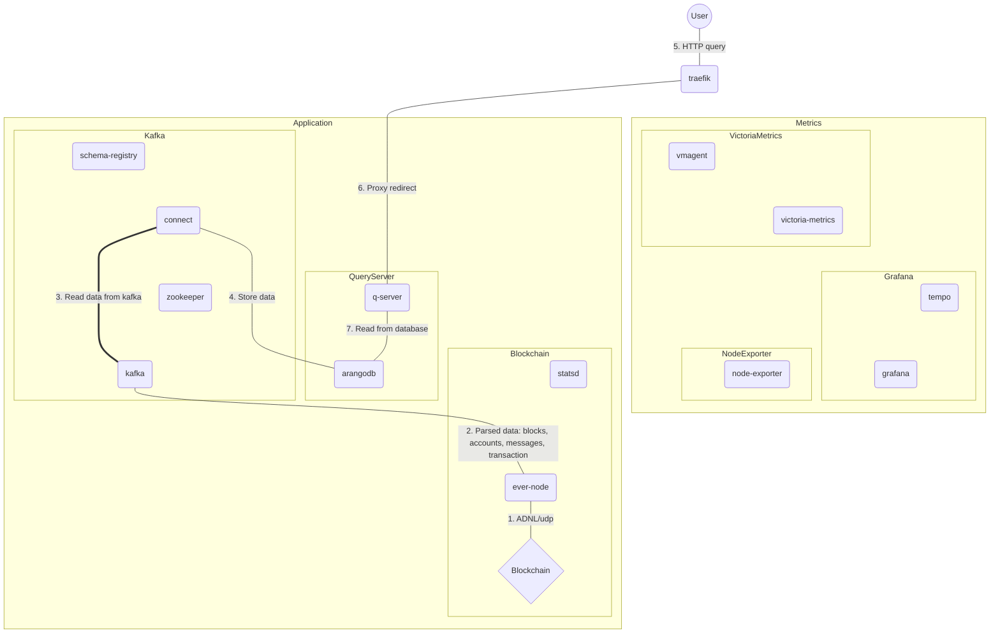

# Application server

Refactored copy of [evernode-ds](https://github.com/tonlabs/evernode-ds)

## Up local

```shell
docker network create traefik
docker compose --env-file .env.local up
```

## Docker network scheme

* `- - -` lines - `traefik` docker network 
* `—————` lines - `application` docker network



Main workflow reading data from blockchain


## Handmade

`docker/kafka-connect-arangodb` files compiled from [kafka-connect-arangodb](https://github.com/tonlabs/kafka-connect-arangodb) and placed manually into directory 
