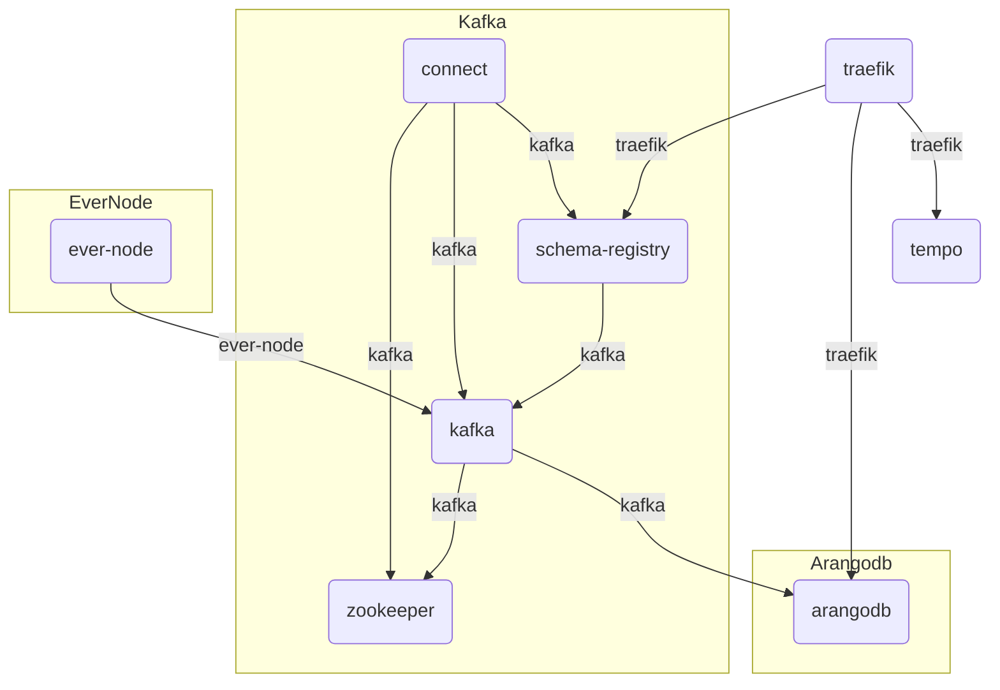

# Application server

Refactored copy of [evernode-ds](https://github.com/tonlabs/evernode-ds)

## Up local

```shell
docker network create traefik
docker compose --env-file .env.local up
```

## Docker network scheme



## Handmade

[kafka-connect-arangodb](https://www.confluent.io/hub/jaredpetersen/kafka-connect-arangodb) v1.0.4 downloaded manually and unzipped into `/docker/kafka-connect-arangodb` because have no exist any good solution. 
